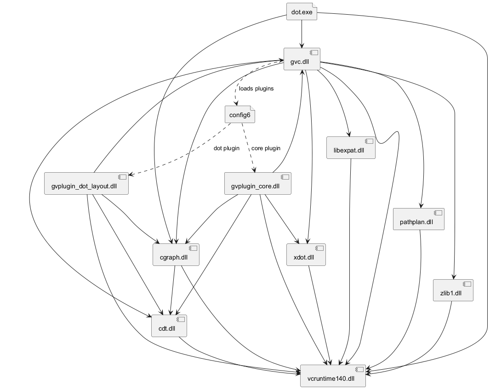

# graphviz-distributions

Latest version: "https://github.com/plantuml/graphviz-distributions/raw/main/graphviz_lite_12.2.1_win32.zip"

Zip file with minimalistic graphviz dot.exe and the set of needed .dll files. Just for plantuml and nothing else.

Set the local environment variable GRAPHVIZ_DOT to the position of the dot.exe file before starting plantuml.jar.

**note**: plantuml V1.2020.21 and above inlcudes a graphviz lite distribution from here. It will be extracted to "%LOCALAPPDATA%\Temp\\_graphviz" IF plantuml doesn't find a dot.exe somewhere else. That means: if you have set the above environment variable GRAPHVIZ_DOT, plantuml uses this place for the dot.exe if there is one and doesn't extract the embedded distribution.

root distribution can be found in https://www.graphviz.org (of course)

License copied from --> https://gitlab.com/graphviz/graphviz/-/blob/master/LICENSE

## How to get there?
Basically it's quite easy: plantuml only uses a small part of graphviz, and graphviz has a modular nature (not that well known as it seems). You can configure the graphviz modules in the file config6 (text file). for plantuml, only the parts gvplugin_core.dll and gvplugin_dot_layout.dll is needed. After that, you can either try-and-error with dot.exe until you have all needed .dll's or you can use a more spohisticated tool like https://github.com/lucasg/Dependencies to track down the needed dll's. Either way, you'll get at the end a running distribution for the dot diagram style.

## dependency graph of last distribution

